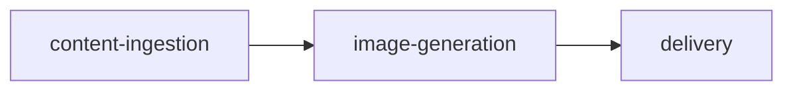

<div align="center">

# 🎨 Pinboard

### AI-powered image generation and reference board application with iterative workflow -- upload references, generate via Google Gemini/fal.ai, feed results back as references


[](https://www.typescriptlang.org/)


[](https://bun.sh/)

</div>

---

## 📽️ Demo

<div align="center">


</div>

---

## 📑 Table of Contents

- [✨ Features](#features)
- [🏗 Architecture](#architecture)
- [🛠 Tech Stack](#tech-stack)
- [🚀 Getting Started](#getting-started)
- [💻 Development](#development)
- [📡 API Reference](#api-reference)
- [📂 Project Structure](#project-structure)
- [🤝 Contributing](#contributing)
- [📄 License](#license)

---

## ✨ Features

| Feature | Description |
|---------|-------------|
| **image-generation** | Core task type |
| **reference-management** | Core task type |
| **visual-content** | Core task type |
| **images Input** | Supported input type |
| **text-prompt Input** | Supported input type |
| **generated-image Output** | Supported output type |
| **image-gallery Output** | Supported output type |

---

## 🏗 Architecture

Pinboard processes data through a multi-stage pipeline:



---

## 🛠 Tech Stack

### Frontend

| Technology | Purpose |
|------------|---------|
| **React 19** | UI framework |
| **React-dom 19** | React DOM renderer |
| **Tailwind CSS 3** | Utility-first styling |
| **Vite 6** | Build tool & dev server |

### Backend

| Technology | Purpose |
|------------|---------|
| **TypeScript 5.8** | Type safety |
| **Bun** | JavaScript runtime & package manager |
| **Hono 4** | Lightweight web framework |

---

## 🚀 Getting Started

### Prerequisites

- [**Bun**](https://bun.sh/) v1.0+ — `curl -fsSL https://bun.sh/install | bash`

### Install

```bash
cd systems/pinboard
bun install
```

### Run

```bash
bun run systems/pinboard/server/src/index.ts
```

---

## 💻 Development

| Command | Description |
|---------|-------------|
| `bun run dev` | Start development mode |
| `bun run build` | Build for production |
| `bun test` | Run tests |
| `bun run lint` | Check code quality |

---

## 📡 API Reference

| Method | Endpoint | Description |
|--------|----------|-------------|
| `POST` | `/upload` | Ensure uploads directory exists |
| `GET` | `/` | GET /images - List all images |
| `GET` | `/:id` | GET /images/:id - Get image metadata |
| `GET` | `/:id/file` | GET /images/:id/file - Serve the actual image file |
| `DELETE` | `/:id` | DELETE /images/:id - Delete an image |
| `POST` | `/generate` | POST / - Generate an image |
| `GET` | `/generations` | GET /generations - List all generations |
| `GET` | `/generations/:id` | GET /generations/:id - Get single generation |
| `POST` | `/generations/:id/use-as-reference` | POST /generations/:id/use-as-reference - Copy generation result to images |
| `GET` | `/` | GET / - List available models |

---

## 📂 Project Structure

```
pinboard/
├── README.md
├── client
│   ├── index.html
│   ├── package.json
│   ├── postcss.config.js
│   ├── public
│   │   └── vite.svg
│   ├── src
│   │   ├── App.tsx
│   │   ├── main.tsx
│   │   └── vite-env.d.ts
│   ├── tailwind.config.js
│   ├── tsconfig.app.json
│   ├── tsconfig.json
│   └── vite.config.ts
├── demo
│   ├── out
│   │   └── video.mp4
│   ├── package.json
│   ├── src
│   │   ├── Main.tsx
│   │   ├── Root.tsx
│   │   ├── index.ts
│   │   └── theme.ts
│   └── tsconfig.json
├── justfile
├── package.json
└── server
    ├── package.json
    ├── src
    │   ├── db.ts
    │   ├── index.ts
    │   └── types.ts
    └── tsconfig.json
```

---

## 🤝 Contributing

Contributions are welcome! Here's how to get started:

1. Fork the repository
2. Create a feature branch: `git checkout -b feat/my-feature`
3. Make your changes and ensure tests pass
4. Commit your changes and open a pull request

---

## 📄 License

This project is licensed under the [MIT License](LICENSE).

---

<div align="center">

**Built with** 🧡 **using Bun, React, Hono, TypeScript**

</div>
